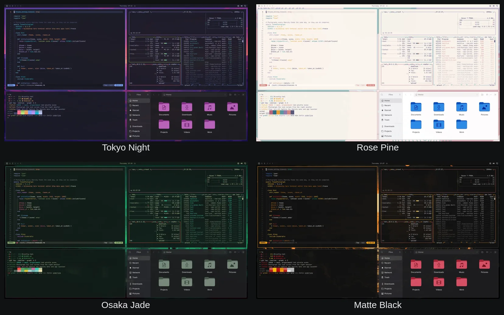
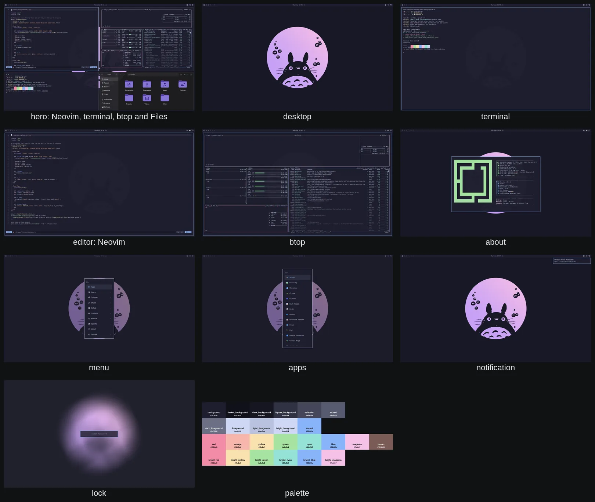

# omarchy-theme-photograph

Take the same set of screenshots of every [Omarchy](https://omarchy.org) theme,
so themes can be compared side by side instead of through whatever preview
image each author happened to upload.

It runs inside a live Omarchy session. It creates a **virtual screen** (a
headless Hyprland output) next to your real ones, opens a fixed set of scenes
on it and photographs each scene with `grim`. Your own screens keep working
while it runs; the only thing you notice is the theme switch itself.

The output is a folder per theme with WebP images, a palette sheet and a
`meta.json`, plus an `index.json` across all themes. That is everything a
static website or a CDN bucket needs.



## What gets photographed

| Scene          | What you see                                                     |
| -------------- | ---------------------------------------------------------------- |
| `desktop`      | Empty workspace: wallpaper and the Omarchy bar                    |
| `hero`         | The classic Omarchy preview: Neovim, terminal, btop and Files tiled 2x2 |
| `terminal`     | A scripted shell session showing all 16 ANSI colours, a git log and a diff |
| `editor`       | Neovim (LazyVim) with a sample Ruby file                          |
| `btop`         | The btop system monitor                                          |
| `about`        | The floating "About" window (fastfetch with the Omarchy logo)     |
| `menu`         | The Omarchy menu (Super + Space)                                 |
| `apps`         | The app launcher                                                 |
| `notification` | A desktop notification                                           |
| `lock`         | The lock screen (shell preview mode, no real locking)            |
| `palette`      | A generated swatch sheet of every colour in `colors.toml`        |
| `colors`       | *(not default)* Omarchy's own palette preview TUI                |
| `files`        | *(not default)* The Files app on its own                         |

Every scene uses the same content for every theme (the sample files live in
`assets/`), the same 1920x1080 logical resolution and the same timing.



## Requirements

- Omarchy 4 (Hyprland with the Lua API, the Quickshell-based shell)
- `grim`, `jq`, `magick` (ImageMagick) — all part of a stock Omarchy install
- For the default scenes: `nvim`, `btop`, `nautilus` (stock as well)

Check with:

```bash
bin/omarchy-theme-photograph doctor
```

## Install

```bash
git clone https://github.com/andreas-bylund/omarchy-theme-photograph ~/.local/share/omarchy-theme-photograph
~/.local/share/omarchy-theme-photograph/install.sh
```

This puts a symlink in `~/.local/bin`, which Omarchy already has on the
`PATH`, and runs `doctor`. Updating is a `git pull` in that folder;
`install.sh --uninstall` removes the link. Running `bin/omarchy-theme-photograph`
straight from a clone works too, which is what the examples below do.

## Usage

Photograph the theme you are using right now:

```bash
bin/omarchy-theme-photograph shoot
```

Photograph a specific theme and switch back afterwards:

```bash
bin/omarchy-theme-photograph shoot --theme tokyo-night
```

Only some scenes, keep the lossless PNGs, different output folder:

```bash
bin/omarchy-theme-photograph shoot --scenes hero,terminal,palette --keep-png --out ~/shots
```

Photograph every theme in `themes.json` (installs community themes with
`omarchy theme install`, switches through them one by one, restores your
original theme at the end and writes `index.json`):

```bash
bin/omarchy-theme-photograph batch                 # everything
bin/omarchy-theme-photograph batch --stock         # only the built-in themes
bin/omarchy-theme-photograph batch --community --remove-after
bin/omarchy-theme-photograph batch --only dracula,nord --skip-existing
```

Rebuild the index after manual changes:

```bash
bin/omarchy-theme-photograph index --out ./out
```

Check a finished batch for pictures that cannot be trusted, then photograph
those themes again:

```bash
bin/omarchy-theme-photograph qa --out ./out
bin/omarchy-theme-photograph batch --only artemis,dracula --remove-after
```

`qa` flags a theme when its menu, launcher, lock or notification picture is
the same as its desktop picture (the popup never appeared) or when a picture
is one flat colour (nothing was painted). Both happen when the Omarchy shell
is in a bad state, see below.

Run `bin/omarchy-theme-photograph --help` for all options. Every option is
also an environment variable (`OTP_OUT`, `OTP_SCENES`, `OTP_WIDTH`, ...).

## Output layout

```
out/
├── index.json                 # all meta.json files merged, sorted by name
└── tokyo-night/
    ├── meta.json              # name, slug, repo, mode, colours, versions, scene files
    ├── palette.json           # the colours from colors.toml
    ├── hero.webp              # 1920 px wide
    ├── hero.card.webp         # 1280 px wide
    ├── hero.thumb.webp        # 640 px wide
    ├── hero.png               # only with --keep-png (3840x2160)
    ├── desktop.webp ...
    ├── palette.webp
    └── wallpapers/            # previews of the wallpapers that ship with the theme
        ├── 1-city-view.card.webp
        ├── 1-city-view.thumb.webp
        └── 1-city-view.png    # the original, only with --keep-wallpapers
```

`meta.json` looks like this:

```json
{
  "name": "Tokyo Night",
  "slug": "tokyo-night",
  "repo": null,
  "stock": true,
  "mode": "dark",
  "colors": { "background": "#1a1b26", "accent": "#7aa2f7", "...": "..." },
  "background": "1-scenery-pink-lakeside-sunset-lake-landscape-scenic-panorama-7680x3215-144.png",
  "source": { "repo": "https://github.com/basecamp/omarchy", "ref": "v4.0.2", "path": "themes/tokyo-night" },
  "omarchy_version": "4.0.2-1",
  "hyprland_version": "v0.56.2",
  "captured_at": "2026-09-03T12:00:00Z",
  "resolution": { "width": 1920, "height": 1080, "scale": 2 },
  "scenes": { "hero": { "full": "hero.webp", "thumb": "hero.thumb.webp", "width": 1920, "height": 1080 } },
  "wallpapers": [
    {
      "file": "1-scenery-pink-lakeside-sunset-lake-landscape-scenic-panorama-7680x3215-144.png",
      "title": "scenery pink lakeside sunset lake landscape scenic panorama 7680x3215 144",
      "format": "png", "width": 7680, "height": 3215, "bytes": 9123456, "sha256": "…",
      "thumb": "wallpapers/1-scenery-….thumb.webp", "card": "wallpapers/1-scenery-….card.webp",
      "original": null,
      "url": "https://raw.githubusercontent.com/basecamp/omarchy/v4.0.2/themes/tokyo-night/backgrounds/1-scenery-….png",
      "page": "https://github.com/basecamp/omarchy/blob/v4.0.2/themes/tokyo-night/backgrounds/1-scenery-….png",
      "current": true
    }
  ],
  "notes": {}
}
```

## Wallpapers

Every theme ships its wallpapers in a `backgrounds/` folder, and they are a
large part of what makes a theme. The tool lists them in `meta.json` and
writes a card (1280 px) and a thumbnail (640 px) WebP of each one under
`wallpapers/`. `current` marks the one that was on screen in the pictures.

The originals are not copied by default. Instead `url` and `page` point at
the exact file in the theme's repository at the commit that was
photographed (Omarchy's release tag for stock themes), so a website can
offer the untouched original without redistributing it. Use
`--keep-wallpapers` to copy the originals into `wallpapers/` as well; they
are then listed in `original` and uploaded by `scripts/upload-r2.sh`. Keep
in mind that many community themes use wallpapers whose licence is unknown.
`--no-wallpapers` skips all of this.

## The theme list

`themes.json` is generated from the community list on
[omarchy.org/themes](https://omarchy.org/themes) plus the stock themes of the
machine it was generated on. Regenerate it with:

```bash
scripts/fetch-theme-list.py
scripts/fetch-theme-list.py --registry   # also the Omarchy theme registry, 300+ themes
```

The [Omarchy theme registry](https://github.com/andreas-bylund/omarchy-theme-registry)
is a community index published as one JSON feed; `--registry` merges it in,
keeping the first entry when a theme appears in both lists.

Each entry has the display `name`, the site `slug`, the git `repo`, and
`install_name`, which is the directory name Omarchy gives the theme when it
installs it (`omarchy-foo-theme` becomes `foo`). Output folders use the
install name.

## Getting consistent pictures

The virtual screen guarantees the same resolution and the same window layout,
but the shell still shows *your* bar layout, plugins, fonts and clock. For a
public gallery, run the batch in a fresh Omarchy VM with an untouched
configuration. See [`vm/README.md`](vm/README.md).

Things worth knowing:

- The lock screen preview is a single shell layer that always lands on the
  first real screen. In a single-screen VM that is fine. On a multi-monitor
  desktop the `lock` scene is captured from your real screen and `meta.json`
  records which one under `notes.lock_monitor`.
- `hero` and `files` show `$HOME` in the file manager. Set `OTP_FILES_DIR` to
  show another folder.
- Animations are turned off and the cursor is hidden while photographing;
  both settings are restored afterwards.
- Switching themes rotates the wallpaper the way `omarchy theme set` always
  does, so after a batch your wallpaper may be a different one from the same
  theme.
- The Omarchy shell stops painting on new virtual screens after a couple of
  dozen of them have come and gone: bar and wallpaper turn black. A batch
  therefore restarts the shell before every theme (`OTP_SHELL_RESTART_EVERY`,
  0 turns it off), and any picture that comes out as one flat colour makes
  the tool restart the shell and take it again.

## Running in a VM over SSH

The tool needs the environment of the running Hyprland session. Over SSH,
wrap it in `scripts/run-in-session.sh`:

```bash
ssh omarchy-vm '~/omarchy-theme-photograph/scripts/run-in-session.sh \
  ~/omarchy-theme-photograph/bin/omarchy-theme-photograph batch --out ~/out'
rsync -a omarchy-vm:out/ ./out/
```

`vm/vm.sh` does all of that for a QEMU/KVM machine on the host: install
Omarchy from the ISO, copy the tool in, run it, pull the pictures back.

```bash
vm/vm.sh install                 # once
vm/vm.sh setup                   # once, after enabling sshd in the VM
vm/vm.sh run batch --stock && vm/vm.sh pull
```

## Publishing to Cloudflare R2

```bash
scripts/upload-r2.sh ./out r2:omarchy-themes/v1
```

The script uses `rclone`, skips PNGs, gives images a one-year cache lifetime
and `index.json` a five-minute one. Point a website at
`https://<your-r2-domain>/v1/index.json` and render the gallery from that.

## Keeping a gallery up to date

Once the first full batch is done, new themes are an incremental job:

```bash
scripts/fetch-theme-list.py --registry            # 1. refresh the list
vm/vm.sh run batch --skip-existing && vm/vm.sh pull   # 2. photograph only the new ones
scripts/upload-r2.sh ./out r2:omarchy-themes/v1   # 3. upload what changed
```

`--skip-existing` skips every theme that already has a `meta.json` in the
output folder; the batch rebuilds `index.json` when it finishes. To photograph
a changed theme again, delete its folder first or run `batch --only <slug>`.
To drop a theme, delete its folder and run `bin/omarchy-theme-photograph index`.
Anything built from `index.json` then picks the changes up at its next build.

## Photographing your own theme

Theme authors can use this to produce the standard set of pictures for a
theme they are working on:

```bash
omarchy theme set my-theme
bin/omarchy-theme-photograph shoot --out ./shots --keep-png
```

`shots/my-theme/hero.png` is a good candidate for the `preview.png` a theme
ships with.

## How it works

1. `hyprctl output create headless` adds a virtual screen, configured with
   `hl.monitor` to 1920x1080 at 2x scale (so the images are 3840x2160).
2. A spare workspace is placed on it and focused.
3. Windows are started through `hl.exec_cmd` with a workspace rule, and the
   tool waits until Hyprland reports them mapped on that workspace.
4. Shell surfaces (menu, launcher, notification, lock preview) are opened via
   `omarchy-menu` / `omarchy-shell` IPC and the tool waits for their layer to
   appear on the virtual screen.
5. `grim -o <output>` captures the frame; ImageMagick writes the WebP files.
6. Everything is closed, the virtual screen is removed and your focus,
   animation and cursor settings are put back.

## Security and privacy

- The tool makes no network requests of its own and sends nothing anywhere.
  The pictures land in a folder on your disk. The only network activity is
  `scripts/fetch-theme-list.py`, which downloads the theme lists you ask for,
  and `batch`, which runs `omarchy theme install` for each community theme.
- `batch` therefore clones repositories written by strangers onto the
  machine it runs on. Omarchy refuses to load code from an installed theme
  (Lua, terminal configs, `vscode.json`), but the files are still on your disk.
  Run batches in the VM (`vm/`), not on the desktop you work on.
- `shoot` on your own desktop switches your theme, opens windows on a virtual
  screen and shows the lock screen preview for a couple of seconds. It puts
  your theme, focus, animation and cursor settings back when it is done.
- Pictures of your own desktop include whatever your bar, plugins and file
  manager show. Check them before publishing.

## Contributing

See [CONTRIBUTING.md](CONTRIBUTING.md) for how to add a scene, run the tests
and try changes without disturbing your desktop. Bug reports are most useful
with the output of `omarchy-theme-photograph doctor`.

## License

MIT, see [LICENSE](LICENSE).
